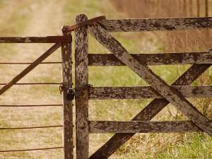

Farmer confidence remains deep in negative territory, according to the latest Rabobank Rural Confidence survey.

The latest survey - completed late June - found that while farmer confidence in the broader agricultural economy wa up marginally on the previous quarter (March 2023), there are still a wide-ranging mix of concerns in the sector. The net confidence in this survey rose to -57% from -58% previously.

Farmers were also more positive about the prospects for their own farm business performance, with the net confidence reading for this measure rising to -35% from -45% previously.

Rabobank New Zealand chief executive Todd Charteris said primary producers' confidence in the broader agri economy, as well as their own farm business performance, had now risen for two consecutive quarters after both measures fell to historic lows in the final quarter of 2022.

"While it is pleasing to see confidence continuing to climb - albeit incrementally - it's important to note that it's coming from an extremely low base and that farmer sentiment across all key agricultural sector remains incredibly fragile."

The survey found the two most pressing issues were rising input costs and government policy.

Despite the small lift in Charteris says there is now a higher percentage of farmers with significant concerns about the viability of their operations.

"The recent margin pressure on farmers has resulted in more now assessing their own operation as unviable, with this rising to eight per cent from five per cent previously."

This was most pronounced for sheep and beef farmers, with 16% of those in the sector now holding concerns about their operation's viability.